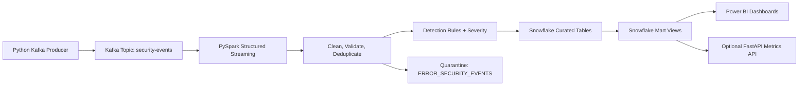

<div align="center">


[](https://git.io/typing-svg)

**An event-driven security analytics platform that ingests operational events, quarantines bad data, detects threat patterns, and turns them into analyst-ready triage.**


</div>

---

## 🚀 Why This Pipeline?

Security and operations teams need timely visibility into event streams such as failed sign-ins, unusual access activity, privilege changes, and API anomalies. Raw event data is often incomplete, duplicated, or late. This platform ingests events **in real time**, validates them, quarantines what fails rather than dropping it, and maps detections to **MITRE ATT&CK** so an analyst knows what they are looking at.

Read the full business case in [PROJECT_SHOWCASE.md](PROJECT_SHOWCASE.md).

---

## ✨ System Highlights

| 🔄 Streaming Ingestion | ⚡ Real-Time Processing | 🧠 Detection & BI |
|:---|:---|:---|
| 📡 Kafka producer simulating SIEM events | 💧 PySpark Structured Streaming | 📊 Power BI security operations dashboards |
| 🚢 Dockerized local Kafka & Zookeeper stack | ✅ Quality gate with quarantine reasons | 🛡️ 8 detections mapped to MITRE ATT&CK |
| 🔑 Actor-keyed partitioning for ordering | ♻️ Watermarked dedupe for at-least-once sources | 🤖 AI triage: risk score, explanation, queue |

---

## Architecture



Detailed architecture notes live in [docs/architecture.md](docs/architecture.md).

For a portfolio-oriented overview, see [PROJECT_SHOWCASE.md](PROJECT_SHOWCASE.md). For a step-by-step interview demo, see [docs/demo_guide.md](docs/demo_guide.md). For the agentic AI module, see [docs/agent_workflow_assistant.md](docs/agent_workflow_assistant.md).

## Folder Structure

```text
.
├── agent_workflow_assistant/ # Agentic workflow planner, tools, and CLI
├── ai_insights/          # Rules-based threat triage insight generator
├── api/                  # Optional FastAPI endpoint for live metrics
├── configs/              # Environment-driven YAML config
├── consumer/             # Debug Kafka consumer
├── dashboards/           # Power BI dashboard design guidance
├── data/                 # Sample JSONL events and agent-assistant fixtures
├── databricks/           # Databricks notebook export
├── docker/               # Kafka, Zookeeper, and Kafka UI
├── docs/                 # Architecture and monitoring docs
├── logs/                 # Runtime logs
├── producer/             # Kafka event generator and producer
├── pyspark_jobs/         # Structured Streaming pipeline modules
├── snowflake/            # Database, tables, and mart views
├── tests/                # Unit and Spark batch tests
├── requirements.txt
└── README.md
```

## What Each Module Does

- `producer/event_generator.py`: creates synthetic security events (authentication, data access, API calls, privilege and config changes) with injected threat patterns and data-quality defects.
- `producer/kafka_producer.py`: publishes generated events to Kafka with idempotent delivery and retry handling, keyed by actor.
- `consumer/kafka_debug_consumer.py`: reads Kafka messages for local smoke testing.
- `pyspark_jobs/schemas.py`: defines the strict streaming event schema.
- `pyspark_jobs/transformations.py`: normalises events, applies quality gates, deduplicates, and flags threat indicators with severity and MITRE ATT&CK mapping.
- `pyspark_jobs/streaming_security_pipeline.py`: reads Kafka and writes either console output or Snowflake tables.
- `databricks/01_streaming_security_pipeline.py`: notebook-style version for Databricks clusters.
- `snowflake/*.sql`: creates schemas, curated tables, and BI-friendly views.
- `dashboards/powerbi_dashboard_guide.md`: lays out Power BI report pages and visuals.
- `api/metrics_api.py`: exposes Snowflake KPI data over REST.
- `ai_insights/threat_insights.py`: generates risk scores, plain-English threat explanations, recommended actions, and triage queue routing.
- `agent_workflow_assistant/`: plans and executes an agentic workflow with tool calls, state passing, recommendations, and optional OpenAI/LangChain summarization.

## Prerequisites

- Python 3.11
- Docker Desktop
- Java 8, 11, or 17 for local Spark
- Git
- Snowflake account for warehouse storage
- Power BI Desktop for dashboarding
- Databricks workspace for managed streaming execution

## Setup

### 1. Create a virtual environment

Windows PowerShell:

```powershell
python -m venv .venv
.\.venv\Scripts\Activate.ps1
python -m pip install --upgrade pip
pip install -r requirements.txt
Copy-Item .env.example .env
```

Mac or Linux:

```bash
python3 -m venv .venv
source .venv/bin/activate
python -m pip install --upgrade pip
pip install -r requirements.txt
cp .env.example .env
```

Edit `.env` with your Kafka and Snowflake values.

### 2. Start Kafka locally

```bash
docker compose -f docker/docker-compose.yml up -d
```

Kafka runs at `localhost:9092`. Kafka UI runs at `http://localhost:8080`.

### 3. Run the Kafka producer

```bash
python -m producer.kafka_producer
```

In another terminal, inspect events:

```bash
python -m consumer.kafka_debug_consumer
```

### 4. Run the local Spark pipeline to console

For a local console demo:

```bash
spark-submit --packages org.apache.spark:spark-sql-kafka-0-10_2.12:3.5.3 pyspark_jobs/streaming_security_pipeline.py --sink console
```

### 5. Create Snowflake objects

Run these scripts in Snowflake:

```sql
-- 1
snowflake/01_create_database_schema.sql

-- 2
snowflake/02_curated_tables.sql

-- 3
snowflake/03_views_for_powerbi.sql
```

### 6. Run the Spark pipeline to Snowflake

Install or attach the Snowflake Spark connector when running Spark. Example:

```bash
spark-submit --packages org.apache.spark:spark-sql-kafka-0-10_2.12:3.5.3,net.snowflake:spark-snowflake_2.12:2.16.0-spark_3.4,net.snowflake:snowflake-jdbc:3.16.1 pyspark_jobs/streaming_security_pipeline.py --sink snowflake
```

For Databricks, import [databricks/01_streaming_security_pipeline.py](databricks/01_streaming_security_pipeline.py), configure secrets under a `snowflake` scope, and attach the Kafka and Snowflake connector libraries to the cluster.

### 7. Connect Power BI

Use `Get Data > Snowflake`, then select:

- `MARTS.VW_REALTIME_KPIS`
- `MARTS.VW_SECURITY_TRENDS`
- `MARTS.VW_THREAT_EVENTS`
- `MARTS.VW_QUARANTINED_EVENTS`
- `MARTS.VW_DATA_QUALITY_SCORECARD`

Dashboard design guidance is in [dashboards/powerbi_dashboard_guide.md](dashboards/powerbi_dashboard_guide.md).

### 8. Optional metrics API

```bash
uvicorn api.metrics_api:app --reload --host 0.0.0.0 --port 8000
```

Open `http://localhost:8000/health` or `http://localhost:8000/metrics/realtime`.

### 9. Run the AI Agent Workflow Assistant

```bash
python -m agent_workflow_assistant.cli --limit 25
```

For the browser UI:

```powershell
.\scripts\run_agent_assistant_web.ps1
```

Open `http://127.0.0.1:8050`.

The browser UI includes workflow templates, CSV/JSON/JSONL/PDF upload with OCR fallback, animated
multi-agent execution, run history, dashboard metrics, explainability panels,
charts, demo/OpenAI mode selection, and JSON/Markdown/PDF-style report export.
The assistant runs in deterministic demo mode by default.
Optional OpenAI mode:

```bash
pip install langchain-openai
export OPENAI_API_KEY="your-key"
python -m agent_workflow_assistant.cli --llm-provider openai
```

Docker option:

```bash
docker compose -f docker/docker-compose.yml up agent-assistant
```

## Data Quality Rules

Events are quarantined rather than dropped when they fail validation. Each quarantined record carries a `quality_failure_reason`:

| Check | Failure reason |
| --- | --- |
| Event type outside the accepted set | `unknown_event_type` |
| Outcome outside success/failure/blocked | `unknown_outcome` |
| Missing or empty actor | `missing_actor` |
| Missing target system | `missing_target` |
| Negative or implausible egress volume | `bytes_out_out_of_range` |
| HTTP status outside 100-599 | `invalid_http_status` |
| Unparseable event time | `unparseable_event_time` |

Duplicate `event_id` values are dropped inside the watermark window, and late events beyond the watermark are excluded from windowed aggregates.

## Threat Detection Rules

| Threat reason | Trigger | Severity | MITRE |
| --- | --- | --- | --- |
| `credential_brute_force` | Failed auth with 10+ failures in the last hour | HIGH | TA0006:T1110 |
| `unauthorized_privilege_escalation` | Successful privilege change by a non-privileged actor | CRITICAL | TA0004:T1078 |
| `large_data_egress` | Data access moving 500 MB or more | CRITICAL | TA0010:T1041 |
| `api_abuse_burst` | API calls at 300+ requests per minute | MEDIUM | TA0040:T1499 |
| `unusual_geo_access` | Successful access from a high-risk country | HIGH | TA0001:T1078.004 |
| `audit_logging_disabled` | Config change that disables logging | CRITICAL | TA0005:T1562.008 |
| `privileged_access_without_mfa` | Privileged success without MFA | MEDIUM | TA0001:T1078 |
| `off_hours_privileged_activity` | Privileged success between 22:00 and 06:00 UTC | LOW | TA0003:T1078 |

Thresholds live in `configs/config.yaml` under `detection_rules`.

Valid events go to `CURATED.FACT_SECURITY_EVENTS`. Invalid events go to `CURATED.ERROR_SECURITY_EVENTS`. One-minute metrics go to `CURATED.AGG_SECURITY_METRICS_1M`.

## Testing

```bash
pytest -q
```

`tests/test_transformations.py` starts a local Spark session and runs the detection and quality rules in batch mode, so the rules are covered without a Kafka broker. GitHub Actions runs the same tests using [.github/workflows/ci.yml](.github/workflows/ci.yml).

## Helper Scripts

Windows PowerShell scripts are available in `scripts/`:

```powershell
.\scripts\start_kafka.ps1
.\scripts\run_producer.ps1
.\scripts\run_spark_console.ps1
.\scripts\run_spark_snowflake.ps1
.\scripts\run_ai_insights.ps1
.\scripts\run_agent_assistant.ps1
.\scripts\run_agent_assistant_web.ps1
.\scripts\stop_kafka.ps1
```

## Production Hardening Ideas

- Use Schema Registry for event contracts.
- Add dead-letter Kafka topics for malformed payloads.
- Store Spark checkpoints in cloud object storage.
- Use Snowflake streams/tasks or dynamic tables for downstream marts.
- Add Great Expectations or Deequ for formal data quality checks.
- Add Terraform for Snowflake, Databricks, and cloud infrastructure.
- Enrich source IPs with real threat intelligence feeds and geolocation.
- Add stateful session analytics for impossible-travel detection.

## AI Threat Insights

After loading threat events into Snowflake, run:

```bash
python -m ai_insights.threat_insights --limit 100
```

This writes risk scores, plain-English threat explanations, recommended actions, and triage queue routing to `CURATED.AI_THREAT_INSIGHTS` and exposes them through `MARTS.VW_AI_THREAT_INSIGHTS`.

See [docs/ai_insights.md](docs/ai_insights.md).

## Scope and Intent

Events are synthetic and generated locally. The detection rules produce prioritised indicators for analyst review; they are not a substitute for a SIEM or a confirmed-detection engine.
