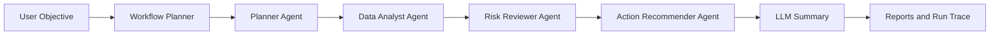

# AI Agent Workflow Assistant

The AI Agent Workflow Assistant is a portfolio-ready agentic AI project that
plans a workflow, calls tools, carries state between steps, and generates an
executive summary with recommended next actions.

## What It Demonstrates

- Agent orchestration with a planner, tool registry, shared state, and run trace.
- Multi-agent roles: Planner Agent, Data Analyst Agent, Risk Reviewer Agent, and
  Action Recommender Agent.
- Workflow templates for sales anomaly investigation, incident response,
  customer support triage, and project review.
- Upload support for CSV, JSON, JSONL, and PDF evidence files.
- OCR fallback for scanned PDFs when Tesseract is installed locally.
- Run history and dashboard metrics saved to local JSON storage.
- Explainability panels for every agent step, including input, decision,
  confidence, and reasoning.
- Charts for channel mix, category mix, risk level, and data quality.
- Tool use across data loading, workflow evidence analysis, and action planning.
- Optional LangChain/OpenAI integration through a lazy adapter.
- A deterministic demo mode that runs without API keys.
- Downloadable JSON and Markdown reports, plus browser print-to-PDF.
- Docker Compose service for local deployment.
- Testable Python architecture for interview walkthroughs.

## Architecture



## Run The Demo

```powershell
python -m agent_workflow_assistant.cli --limit 25
```

## Run The Web App

```powershell
.\scripts\run_agent_assistant_web.ps1
```

Then open:

```text
http://127.0.0.1:8050
```

The web app supports template selection, local evidence upload, demo/OpenAI mode
selection, animated execution steps, run history, charts, explainability, and
report export.

## Docker

```powershell
docker compose -f docker/docker-compose.yml up agent-assistant
```

Then open:

```text
http://127.0.0.1:8050
```

## Scanned PDF OCR

Text-based PDFs work with the bundled Python parser. Scanned PDFs require the
Tesseract OCR engine to be installed on the machine and available on `PATH`.
After installing Tesseract, restart the web app and upload the PDF again.

OpenAI mode is optional:

```powershell
pip install langchain-openai
$env:OPENAI_API_KEY="your-key"
python -m agent_workflow_assistant.cli --llm-provider openai
```

## Resume Bullet

Built an AI Agent Workflow Assistant in Python with planner-driven workflow
orchestration, tool calling, shared execution state, LangChain/OpenAI-compatible
summarization, and automated recommendations for operational decision support.

## Interview Talking Points

- The planner turns a business objective into concrete executable steps.
- The tool registry makes the assistant extensible without changing the
  workflow runner.
- The run trace shows every step, status, input, and output for observability.
- The FastAPI frontend turns the workflow into a clean, recruiter-friendly demo.
- The upload and export features make the assistant feel like a practical tool
  rather than a fixed script.
- The run history, dashboard cards, and explainability panels create a
  production-style AI operations experience.
- Demo mode keeps the project reliable during interviews even without network
  access or API credentials.

See [demo_script.md](demo_script.md) for a two-minute interview walkthrough.
