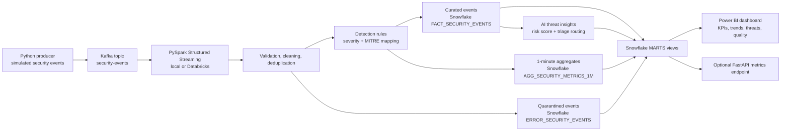

# Architecture

## Data Flow

1. The producer emits JSON security events (authentication, data access, API calls, privilege and config changes) to Kafka, keyed by actor so one identity's events stay ordered within a partition.
2. Spark reads Kafka in micro-batches, parses the JSON payload against a strict schema, and applies quality checks.
3. Duplicate `event_id` values are dropped inside the watermark window; late events beyond the watermark are excluded from windowed aggregates.
4. Detection rules attach a threat reason, severity, and MITRE ATT&CK tactic to each event.
5. Valid events, quarantined events, and aggregate metrics are written to Snowflake through `foreachBatch`.
6. The AI insights job scores threat events and routes them to a triage queue.
7. Power BI connects to Snowflake mart views for security operations reporting.

## Design Decisions

- **Quarantine over drop.** Records failing validation are written to `ERROR_SECURITY_EVENTS` with a `quality_failure_reason` so data issues stay visible in the quality scorecard instead of silently disappearing.
- **UTC session timezone.** The Spark session pins `spark.sql.session.timeZone` to UTC. Hour-of-day rules such as off-hours privileged activity would otherwise shift with the cluster's local timezone.
- **Separate anomaly and defect injection.** The generator injects threat patterns and data-quality defects at independent rates, so detection coverage and quarantine coverage can be demonstrated separately.
- **Rules first, LLM optional.** Detection and scoring are deterministic and explainable; the narrative layer is isolated so an LLM provider can replace only the explanation function.

## Operational Notes

- Kafka partitions can be increased as event volume grows; actor-keyed partitioning preserves per-identity ordering.
- Spark checkpoint locations must be durable in production, for example DBFS or cloud object storage.
- Snowflake warehouses should use auto-suspend and separate ingestion/reporting workloads for cost control.
- Detection thresholds are configuration, not code: see `detection_rules` in `configs/config.yaml`.
