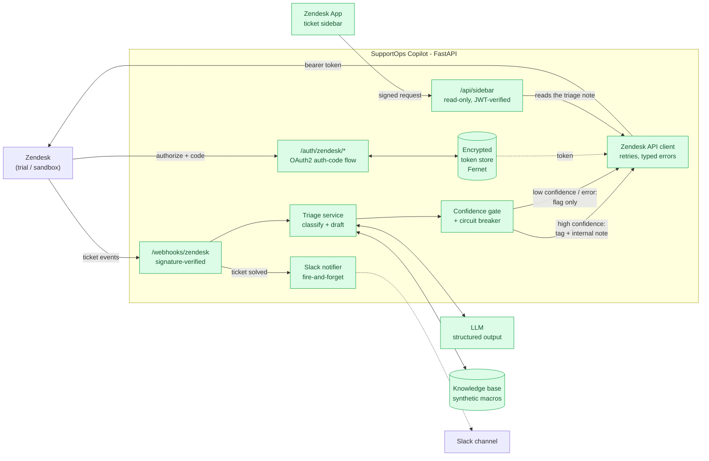

# SupportOps Copilot

AI-assisted triage for Zendesk support tickets. A ticket arrives, and before an
agent opens it the copilot has classified it, drafted a grounded reply, scored
its own confidence, and either staged the draft as an internal note or flagged
the ticket for manual triage.

The design principle the whole project is built around: **fail safe, and fail
visibly.** Nothing is ever auto-sent to a customer, and when the copilot is
unsure - or the model is down, or the response is malformed - the ticket is left
untouched except for one unmistakable `ai-needs-manual-triage` tag. Silence is
treated as a bug, not a fallback.

> **Build status: stages 1, 3, 4, 5, 6 and 7 of 8 complete.** Only stage 2 --
> live verification against a real Zendesk account -- remains. This README describes what exists
> today and is explicit about what does not. See
> [Roadmap and honest status](#roadmap-and-honest-status).

---

## Architecture



Green is implemented and tested. Dashed grey is not built yet.

---

## What works today

The whole system: webhook in, triage, ticket updated, Slack summary out, and an
agent-facing sidebar that reads the result back. What remains is pointing it at
a real Zendesk account.

### Stage 1 -- OAuth2 and the FastAPI service

| Endpoint | Purpose |
|---|---|
| `GET /healthz` | Liveness probe. Touches no external service. |
| `GET /auth/zendesk/login` | Issues a single-use CSRF `state` and redirects to Zendesk consent. |
| `GET /auth/zendesk/callback` | Validates `state`, exchanges the code for a token, persists it encrypted. |
| `GET /auth/zendesk/status` | Reports connection state, scope, expiry, and staleness - never the token. |

Alongside those:

- **Encrypted token store** (`app/auth/token_store.py`) - Fernet (AES-128-CBC +
  HMAC-SHA256) with the key supplied via environment, atomic writes so a crash
  cannot truncate the token, and `0600` on POSIX. The plaintext token never
  reaches disk; there is a test asserting exactly that.
- **CSRF state store** (`app/auth/state.py`) - 256-bit random values, single-use,
  TTL-bounded.
- **OAuth client** (`app/auth/oauth.py`) - authorize-URL construction, code
  exchange, refresh, and a `get_valid_access_token()` that renews inside a
  configurable leeway window.
- **Typed errors** (`app/auth/errors.py`) - callers can distinguish "Zendesk said
  no" from "never authorized" from "dead token, a human must re-consent".

### Verified, not assumed

Everything below was actually run on 2026-08-18:

```
444 passed in 6.96s         # pytest
All checks passed!          # ruff check .
```

The service was also started under uvicorn and driven with `curl`: `/healthz`
returned `{"status":"ok"}`, `/auth/zendesk/login` issued a correct 307 to
`https://<subdomain>.zendesk.com/oauth/authorizations/new?...`, and a forged
`state` on the callback was rejected with a 400 before any token exchange.

**The Docker image builds, runs, and serves.** `docker build` succeeds, the
container runs as a non-root user (uid 10001), its healthcheck reports
`healthy`, and the same signed-webhook and sidebar checks below pass *inside the
container* -- which is how the missing-knowledge-base bug in the engineering
journal was found.

The sidebar endpoint was driven against a running server too: no token, a
forged token, and an `alg: none` token each returned 401; a valid token reached
Zendesk and returned 502 (correct -- no Zendesk account is authorised yet); an
invalid ticket id returned 400.

The webhook endpoint was also driven end to end against a running server with
signatures generated by `openssl dgst -sha256 -hmac` -- an independent
implementation, so this is a genuine cross-check of the HMAC construction rather
than the code agreeing with itself. A correctly signed delivery returned 202 and
queued the work; an unsigned one, a tampered body, and a correctly-signed-but-
stale timestamp each returned 401.

**Not yet verified against a live Zendesk account.** The trial has not been
created. Every Zendesk interaction so far is exercised against a mocked token
endpoint (`respx`). This is the single biggest caveat in the project right now.

### Stages 3 and 4 -- triage and the fallback layer

A ticket goes in; exactly one decision comes out. There is no third path.

| Component | What it does |
|---|---|
| [`app/llm/client.py`](app/llm/client.py) | Calls Claude Opus 5 with a JSON-schema-constrained response, converts every failure into a typed error, and fronts the whole thing with a circuit breaker |
| [`app/llm/schemas.py`](app/llm/schemas.py) | The model's contract: category, urgency, sentiment, self-reported confidence, and a grounded draft with cited article IDs |
| [`app/triage/knowledge_base.py`](app/triage/knowledge_base.py) | BM25 retrieval with light stemming over 8 clearly-marked synthetic resolved tickets |
| [`app/triage/decision.py`](app/triage/decision.py) | The confidence gate and the draft safety checks. Produces either `APPLY` or `FLAG_ONLY`, never nothing |
| [`app/triage/service.py`](app/triage/service.py) | Orchestrates classify -> retrieve -> draft -> gate, and funnels every exception into a flag-only decision |
| [`app/circuit.py`](app/circuit.py) | Closed / open / half-open breaker so a model outage fails fast rather than adding latency to every ticket |

Nine distinct fallback reasons are modelled, each with its own agent-readable
explanation: empty ticket, low classification confidence, low draft confidence,
model unavailable, circuit open, malformed response, model refusal, draft
rejected by a safety check, and ungrounded draft.

### Stage 5 -- the webhook and the Zendesk API client

| Component | What it does |
|---|---|
| [`app/webhooks/signature.py`](app/webhooks/signature.py) | HMAC-SHA256 verification of the signed payload, in constant time, with replay rejection |
| [`app/webhooks/events.py`](app/webhooks/events.py) | Parses the event type and ticket id, treating a signed payload as untrusted shape |
| [`app/webhooks/processor.py`](app/webhooks/processor.py) | Fetch, triage, write back. Runs after the response; nothing escapes it |
| [`app/routes/webhooks.py`](app/routes/webhooks.py) | `POST /webhooks/zendesk` -- verify, queue, return 202 |
| [`app/zendesk/client.py`](app/zendesk/client.py) | Typed wrapper: get ticket, add tags, add internal note, with jittered retries |

Two decisions in here are load-bearing:

**Acknowledge fast, work later.** Zendesk gives a webhook roughly ten seconds
before recording a delivery failure and retrying. Triage makes two LLM calls and
routinely takes longer. Doing the work inline would mean Zendesk retrying a
ticket we are still processing -- duplicate triage on every slow ticket. So the
handler verifies, queues a background task, and returns 202 immediately. (The
project's own synthetic knowledge base has an article advising exactly this;
pleasant to find the codebase agreeing with its own corpus.)

**A loop guard.** Our own write fires `ticket.updated`, which would re-triage the
ticket we just triaged, forever. `ZendeskTicket.already_triaged` checks for any
`ai-` tag and skips.

### Stage 6 -- the agent sidebar

| Component | What it does |
|---|---|
| [`zendesk_app/manifest.json`](zendesk_app/manifest.json) | ZAF v2 app, `ticket_sidebar` location, with a `secure` shared-secret parameter |
| [`zendesk_app/assets/main.js`](zendesk_app/assets/main.js) | Fetches one payload via `client.request()` and renders it |
| [`app/routes/sidebar.py`](app/routes/sidebar.py) | `GET /api/sidebar/tickets/{id}/triage` -- read-only, JWT-verified |
| [`app/sidebar/auth.py`](app/sidebar/auth.py) | Verifies the request Zendesk signs with the app's shared secret |
| [`app/sidebar/payload.py`](app/sidebar/payload.py) | Rebuilds the decision from the ticket's own notes |

Three decisions shaped this:

**No second datastore.** The sidebar needs to know what triage decided, and the
obvious answer is a database keyed by ticket id. Instead, every internal note
now carries a one-line machine-readable footer, so the decision lives on the
ticket that owns it. Zendesk stays the single source of truth, there is nothing
to keep in sync, and a ticket exported or migrated carries its own history. The
cost is one visible line of JSON at the bottom of the note.

**As little logic in JavaScript as possible.** The sidebar JS fetches one
payload and renders it; deciding *what state the sidebar is in* happens in
Python, where it has 26 tests. Every branch moved out of the browser is a branch
that gets tested.

**`client.request()`, not `fetch()`.** Zendesk proxies the call and signs it with
the app's shared secret, which the backend verifies. A bare `fetch()` would be
an unsigned cross-origin request needing CORS opened up -- trading a real
authentication boundary for convenience. Without that check the endpoint is an
unauthenticated read of any ticket in the account by id.

The endpoint is also **read-only by construction**, with a test asserting the
router exposes nothing but `GET`. The sidebar shows what triage decided; it
cannot start a triage or write to a ticket, so it can be installed for every
agent without widening what the integration can do.

### Stage 7 -- Slack, and knowing when not to write code

| Component | What it does |
|---|---|
| [`app/slack/client.py`](app/slack/client.py) | Posts to an Incoming Webhook. Short timeout, no retries, never raises |
| [`app/slack/message.py`](app/slack/message.py) | Block Kit payload with a text fallback for mobile push and screen readers |
| [`app/notifications/resolution.py`](app/notifications/resolution.py) | Builds the summary, including whether an agent actually used the AI's draft |
| [`docs/low-code-alternative.md`](docs/low-code-alternative.md) | The same notification in Zapier / Make / a native Zendesk trigger, and when each is the right call |
| [`zendesk/triggers/`](zendesk/triggers/), [`zendesk/macros/`](zendesk/macros/) | Liquid-templated triggers and a macro, as version-controlled config |

The summary carries ticket ID, category, resolution time, and **whether the
draft was used** -- which is the only field that says whether this tool earns
its place, and the only one Zendesk does not record. It is inferred by comparing
the agent's public reply against the draft staged in the internal note, with a
deliberately high similarity threshold and `UNKNOWN` as a first-class outcome:
a solved ticket with no public reply (duplicate, spam, resolved by phone) must
not be counted as a rejection of the draft.

Slack is decoupled by construction, not by promise: resolution notifications are
queued as their own background task sharing no state with triage, the notifier
returns a bool and catches everything, there are no retries (a stale
notification arriving hours later is worse than none), and an unset webhook URL
is a no-op rather than an error.

---

## Tests

**444 tests, of which 313 exercise failure, adversarial, or defensive paths.**

"Failure path" means a test whose subject is a rejection, a malformed or hostile
input, an upstream error, a security or safety property, or a boundary -- not a
happy-path assertion. Counted by hand, not by keyword match.

| File | Tests | Covers |
|---|---:|---|
| [`test_decision.py`](tests/test_decision.py) | 44 | The confidence gate, draft safety checks, every fallback note |
| [`test_resolution_summary.py`](tests/test_resolution_summary.py) | 37 | Draft-usage inference, resolution timing, timezone normalisation |
| [`test_ticket_processor.py`](tests/test_ticket_processor.py) | 32 | Background processing; that nothing at all escapes it |
| [`test_knowledge_base.py`](tests/test_knowledge_base.py) | 32 | BM25 retrieval, stemming, determinism, empty results |
| [`test_zendesk_client.py`](tests/test_zendesk_client.py) | 31 | Error mapping, retries, rate limits, write ordering, loop guard |
| [`test_webhook_signature.py`](tests/test_webhook_signature.py) | 26 | HMAC verification, tampering, replay, malformed headers |
| [`test_triage_service.py`](tests/test_triage_service.py) | 26 | End-to-end triage with the model stubbed; every failure route |
| [`test_sidebar_payload.py`](tests/test_sidebar_payload.py) | 26 | Reading a decision back off a ticket, and every way that can fail |
| [`test_sidebar_auth.py`](tests/test_sidebar_auth.py) | 26 | JWT verification, expiry, and algorithm-confusion attacks |
| [`test_llm_client.py`](tests/test_llm_client.py) | 23 | Structured output, refusals, truncation, retries, breaker |
| [`test_token_store.py`](tests/test_token_store.py) | 22 | Encryption at rest, tamper detection, staleness |
| [`test_slack.py`](tests/test_slack.py) | 21 | Message building, and that Slack cannot break anything |
| [`test_oauth_client.py`](tests/test_oauth_client.py) | 20 | Code exchange, refresh, token validity, upstream failures |
| [`test_sidebar_route.py`](tests/test_sidebar_route.py) | 18 | The sidebar endpoint: authenticated, rejected, and read-only |
| [`test_webhook_route.py`](tests/test_webhook_route.py) | 17 | Accepted, rejected, and malformed deliveries |
| [`test_auth_routes.py`](tests/test_auth_routes.py) | 15 | OAuth endpoints through the real app |
| [`test_circuit_breaker.py`](tests/test_circuit_breaker.py) | 11 | Closed / open / half-open and the single-probe rule |
| [`test_oauth_state.py`](tests/test_oauth_state.py) | 9 | CSRF state: replay, forgery, expiry, concurrency |
| [`test_startup_checks.py`](tests/test_startup_checks.py) | 8 | Refusing to boot without a knowledge base; missing-secret warnings |

The four cases the brief singles out each have their own test class:
`TestHighConfidenceSuccess`, `TestLowConfidenceFallback`,
`TestLLMFailureFallbacks`, and the malformed-response half of `TestFailureModes`.

Adversarial cases worth calling out:

- A **forged OAuth `state`** is rejected *before* the authorization code is used.
- A **tampered webhook body** with an otherwise-valid signature is rejected, and
  every rejection returns the same opaque 401 -- telling an attacker which check
  failed is free information.
- A **correctly signed but stale** delivery is rejected, so a captured request
  cannot be replayed indefinitely.
- An **`alg: none` JWT** on the sidebar endpoint is rejected: the algorithm is
  pinned in code and the token's own header is never consulted.
- **Zendesk is never called for an unauthenticated sidebar request** -- there is
  a test asserting the auth check precedes any read of customer data.
- **Tampered ciphertext** in the token file raises rather than half-decoding.
- A **model refusal** (HTTP 200, `stop_reason: "refusal"`, empty content) raises
  before anything reads `content[0]`, where a naive integration throws.
- A **citation the retriever never returned** is dropped, so an invented article
  ID cannot pass the grounding check.
- A **draft promising a refund** is rejected at confidence 1.0 -- the safety
  check is not something the model can talk its way past.
- **No fragment of a rejected draft** is echoed into the ticket note.
- An **internal note is never public**; there is a test asserting the flag,
  because a `true` there is the one outcome the project exists to prevent.
- **Nothing escapes the background processor** -- Zendesk errors, OAuth errors,
  Slack errors, and arbitrary bugs all leave the ticket flagged rather than lost.
- A **solved ticket with no public reply** is `UNKNOWN`, not "draft rejected",
  so the one metric that measures this tool's value cannot quietly deflate.
- A **naive timestamp** is read as UTC, not as host-local time -- otherwise
  every resolution time is wrong by the server's offset, plausibly.
- A **missing knowledge base** stops the service booting rather than surfacing
  as a 500 on the first customer ticket.
- A **note written by a newer build** degrades the sidebar to "cannot read this"
  rather than rendering half-understood fields.

```bash
cd supportops-copilot && ./.venv/Scripts/python.exe -m pytest -q
```

CI additionally syntax-checks the sidebar JavaScript (`node --check`) and
validates every app and automation JSON file, because neither is covered by the
Python suite.

## Setup

### 1. Create a Zendesk trial

Sign up at `zendesk.com`. The **subdomain you choose is permanent** for that
account - pick something presentable. The trial is Zendesk Suite Professional
for **14 days**, which is enough for API access, webhooks, triggers, and the
Apps framework.

Because the clock starts at signup, do not create the trial until you are ready
to use it. Stage 1 runs entirely against mocks.

### 2. Register an OAuth client

Admin Center, then **Apps and integrations > APIs > Zendesk API > OAuth Clients
> Add OAuth client**.

| Field | Value |
|---|---|
| Client Name | `SupportOps Copilot` |
| Unique identifier | `supportops_copilot` - this becomes your `client_id` |
| Redirect URLs | `http://localhost:8000/auth/zendesk/callback` |

The **secret is displayed exactly once**. Copy it immediately; regenerating it
invalidates every token already issued.

### 3. Configure

```bash
cp .env.example .env
```

Generate the encryption key and paste it into `TOKEN_ENCRYPTION_KEY`:

```bash
python -c "from cryptography.fernet import Fernet; print(Fernet.generate_key().decode())"
```

Fill in your subdomain, client id, and secret. `.env` is gitignored.

### 4. Run

```bash
python -m venv .venv && ./.venv/Scripts/python.exe -m pip install -r requirements.txt
```

```bash
./.venv/Scripts/python.exe -m uvicorn app.main:app --reload
```

Then open `http://localhost:8000/auth/zendesk/login` in a browser and complete
consent. `GET /auth/zendesk/status` should report `connected: true`.

Docker:

```bash
docker compose up --build
```

---

## Design decisions

### Fail safe, not silent

The failure mode that destroys trust in a support-automation tool is not a bad
draft - an agent will catch that. It is the ticket that quietly received no
treatment while the dashboard implied it did. So every uncertain path converges
on one visible outcome: tag the ticket `ai-needs-manual-triage`, change nothing
else, and log why. There is deliberately no path where the copilot does nothing
and says nothing.

This principle already shapes Stage 1. `get_valid_access_token()` does not
return a token it knows is about to be rejected - it raises
`ReauthorizationRequiredError` naming the expiry. A corrupt token file raises
rather than being silently treated as "no token stored", because those two
states demand different human responses.

### Zendesk tokens do not expire, so what does "refresh logic" mean?

Zendesk's default OAuth access token has no expiry and no refresh token. An
expiring token is opt-in: request `expires_in` on the exchange and you get a
`refresh_token` back.

Handling only one of those cases would be a latent bug, so `TokenRecord` models
expiry as genuinely optional and the client branches on it explicitly:

| Token shape | Behaviour |
|---|---|
| No expiry | `is_stale()` is always `False`; refresh is never attempted |
| Expiring, has refresh token | Renewed automatically inside the leeway window |
| Expiring, no refresh token | `ReauthorizationRequiredError` - a human must re-consent |

The third row is the one that silently breaks integrations in production, which
is why it raises loudly.

**Caveat, stated plainly:** the exact current behaviour of Zendesk's `expires_in`
and `refresh_token` support was not verified against live Zendesk documentation
or a live account during this build. The refresh path is exercised only against
mocks. Confirm it on the Zendesk developer docs before relying on it.

### Structured LLM output over text parsing

Regex over free-form model prose is a parser you did not choose and cannot
version. A JSON-schema-constrained response turns "the model rambled" into a
`ValidationError`, which the fallback layer can act on as a first-class outcome.

Two implementation details are load-bearing:

- The call uses `messages.create` with `output_config.format`, not
  `messages.parse`. `output_config` is the only place `format` and `effort` can
  be set together, and validating the JSON ourselves makes the
  malformed-response path an explicit branch rather than an SDK internal --
  which is precisely the branch that most needs a test.
- Pydantic emits JSON Schema keywords the API rejects (`minimum`, `maxLength`,
  and friends, from `Field(ge=..., le=...)`). Rather than maintaining a parallel
  hand-written schema per model, [`schema_tools.py`](app/llm/schema_tools.py)
  derives the schema and strips them. The constraints still run client-side, so
  a confidence of `4.2` is a malformed response rather than a silent pass -- and
  there is a test asserting exactly that.

### Choosing the confidence thresholds

Classification is gated at **0.75** and drafts at **0.70**. Two things set them:

- **The costs are asymmetric.** A false fallback costs an agent nothing they
  were not already going to do -- they read the ticket. A false apply puts a
  confidently wrong category and a wrong draft in front of them, which is worse
  than no help at all, because it anchors them. So the thresholds sit
  deliberately high and the failure is biased toward doing nothing.
- **Drafting is gated lower than classification.** A draft is reviewed
  word-by-word before an agent sends it; a category quietly changes routing and
  SLA. The thing a human scrutinises less needs the higher bar.

**These are reasoned starting points, not tuned values.** Tuning them honestly
needs a labelled set of real tickets scored against agent decisions, and this
project has no real tickets by design. What the code does provide is the
plumbing to tune them: `Thresholds` is injected, not hardcoded, and every
decision records the confidence that produced it. Claiming a tuned number here
would be the fabricated part of the project.

The model is also explicitly prompted for *calibration*, not just a number --
the schema description tells it that a genuinely ambiguous ticket belongs below
0.7, because a self-reported confidence is only useful if the model has been
told what the scale means.

### BM25 retrieval rather than embeddings

For eight articles, an embedding index adds a second network dependency, a
second failure mode, and non-determinism across model versions -- and
non-determinism is expensive here, because the fallback tests are the ones that
have to be trustworthy. Lexical scoring is deterministic and has no external
dependency. At a few thousand articles this trade-off inverts.

### Retries: bounded, and not duplicated

The Anthropic SDK already retries 429s and 5xx with exponential backoff. Adding
our own layer on top would multiply the attempt count rather than add
resilience, so the client configures `max_retries` and adds exactly one retry of
its own -- for schema-validation failures, which the SDK cannot know about.

A malformed response deliberately does **not** trip the circuit breaker. The
service answered; one badly-worded prompt should not take the whole integration
offline. A refusal does trip it, because a stream of refusals means something
systemic is wrong with what we are sending.

### Where the code/low-code line sits

Most of stage 7 should not have been code, and
[`docs/low-code-alternative.md`](docs/low-code-alternative.md) says so with the
Zapier and Make builds written out. Three of the four fields in the Slack
summary -- ticket ID, category, resolution time -- are direct payload mappings a
Zap does in twenty minutes with no tests to maintain and no pull request needed
when a support lead wants to reword the message.

The fourth field is different. "Was the AI's draft used?" needs the comment
thread fetched, our own internal note located, the draft extracted, and a
similarity comparison run with a threshold and a three-state outcome. In Zapier
that is a Code step plus three API-call steps -- the code still exists, it just
lives in a browser textarea with no version control.

The line I would draw: **if the logic has more than one interesting failure
mode, it belongs in code.** A Slack message either sends or does not. The
confidence gate has nine distinct ways to decline, each needing its own
explanation on the ticket.

### Encryption at rest for tokens

A Zendesk access token with `write` scope can modify every ticket in the
account. Storing it as plaintext JSON means it leaks through any repo mistake,
container layer, or backup. Fernet with an environment-supplied key keeps the
ciphertext and the key in different places. The test
`test_plaintext_token_never_appears_on_disk` asserts the property directly
rather than trusting the library.

---

## Engineering journal

Real problems hit while building, kept here rather than smoothed over.

### `scope=read+write` vs `scope=read%20write`

`urllib.parse.urlencode` encodes spaces as `+`. Correct for
`application/x-www-form-urlencoded`, but RFC 6749 defines `scope` as a
space-delimited list in a query string, and not every provider decodes `+` back
to a space. A provider that does not would read a single scope named
`read+write` and grant nothing.

Caught by looking at the actual `Location:` header from a running server, not by
a test - the test used `parse_qs`, which normalises `+` to a space and so passed
either way. Fixed with `urlencode(params, quote_via=quote)` plus a new test that
asserts against the raw string.

**The transferable lesson:** a test that parses the output cannot catch an
encoding bug in the output. Assert on the wire format when the wire format is
what the other system reads.

### The image built fine and the container was broken

`docker build` succeeded, the container started, the healthcheck went green, and
`/healthz` returned `ok`. The first signed webhook returned **500**.

`COPY app ./app` never copied `data/`, so the knowledge base was not in the
image. `.dockerignore` excluded `data/` outright, so even adding a `COPY` would
have silently done nothing until that was fixed too. Every triage would have
failed on a real deployment, and nothing before this point could have caught it:
444 tests pass because they run from a working directory where the file exists.

The second-order failure was the interesting one. The **unsigned** webhook also
returned 500, where it should have returned 401. FastAPI resolves a route's
dependencies before running its body, so a missing knowledge base took down the
*signature check itself* -- an unauthenticated caller got a stack trace instead
of a clean rejection. A missing data file had quietly become an availability
bug in the security layer.

Fixed in three places: copy the file, stop ignoring it, and load it at startup
so a broken image refuses to boot rather than failing on the first customer
ticket. The startup check now logs `Knowledge base loaded: 8 articles
(synthetic=True)`, which also makes it obvious in container logs that the corpus
is the fake one.

The lesson is the one this whole project keeps relearning from a different
angle: **a green test suite tells you the code is right, not that the artefact
you ship contains it.** Building the image was not enough either -- it built
perfectly. Only running it and sending a real request found this.

### Shell escaping ate three source edits before I noticed

Patching a `"\n".join(...)` expression through a heredoc kept producing a
literal newline inside the string, so the file came back as a syntax error --
three times, each time with a slightly different guess at the escaping.

The lesson is not about escaping. It is that I kept re-attempting a failing
approach with small variations instead of switching tools. The fourth attempt
used the editor tool, which does not pass content through a shell at all, and
worked immediately. Two rounds of "try the same thing again, but more carefully"
cost more than one round of "this tool is wrong for this job".

I have kept it in the journal because it is the least flattering entry and the
most repeatable mistake.

### The same seam bug, twice

`SlackNotifier.notify` is written to catch everything and return a bool -- its
docstring says a contract with exceptions in it is not a contract. So
`TicketProcessor.notify_resolution` called it unwrapped.

A test using a deliberately misbehaving fake notifier caught it: if the notifier
itself raises, the exception escapes the background task, and the resolution
summary is lost with only a traceback.

This is the *same bug* as the OAuth-seam one below, found a second time in a
different place: **trusting a neighbouring component's promise instead of
enforcing it at the boundary.** The first time it was `ZendeskError` not covering
OAuth failures; this time it was "SlackNotifier never raises" being true of the
current implementation and not of the interface.

The fix is a `try/except` in the caller, and the durable lesson is that a
component at a process boundary -- anything running in a background task -- has
to defend itself rather than rely on what its dependencies claim. I now treat
"this can't throw" in a docstring as documentation of intent, not as a
guarantee I can build on.

### A live run found what 288 passing tests did not

With the whole chain wired up, I posted a correctly signed webhook to a running
server. It returned 202 as designed, then the background task crashed with an
unhandled `NoStoredTokenError` and a raw traceback. The ticket was neither
triaged nor flagged -- precisely the outcome this project is built to prevent.

The cause was an error-taxonomy seam. `TicketProcessor` catches `ZendeskError`,
which covers everything the Zendesk client is documented to raise. But
`ZendeskClient._request` calls `oauth.get_valid_access_token()`, and that raises
from the *OAuth* hierarchy -- `NoStoredTokenError`, `ReauthorizationRequiredError`.
Two well-designed error taxonomies, and the bug lived exactly in the gap between
them.

The tests missed it for a specific and instructive reason: `FakeZendesk` only
ever raised `ZendeskError` subclasses, because that is what the client's
docstring promises. **The fake encoded the same wrong assumption as the code, so
it could never contradict it.** A hand-written fake tests your model of the
dependency, not the dependency.

Fixed in two places: the Zendesk client now translates OAuth errors into
`ZendeskAuthError`, so it presents one error taxonomy as its contract claims;
and the processor catches bare `Exception` as a backstop, because a background
task that raises loses the ticket with nothing but a traceback. Both have
regression tests, including one parameterised over unrelated exception types.

The transferable lesson is about where to spend verification effort: the bug was
not in any single component, it was in the seam between two, and only running
the real thing crossed that seam.

### The retriever quietly turned working tickets into fallbacks

A test drafted a ticket with the subject `"Charged twice"` and expected it to be
triaged. It fell back with `ungrounded_draft` instead.

The cause was in the retriever, not the gate. BM25 with no stemming means
`charged` never matches an article that says `charges`, and `twice` never
matches `two`. The ticket retrieved zero articles, so the model had nothing to
cite, so the grounding check correctly refused to apply an ungrounded draft.

Every layer behaved exactly as designed and the outcome was still wrong. That is
the interesting part: **the fail-safe design converted a retrieval-quality
problem into a total loss of function, silently and safely.** A system that
falls back on every ticket is safe and useless, and nothing in the fallback
logic would ever flag it -- each individual fallback looks like a correct
decision.

Fixed by adding a small suffix stemmer. The wider lesson is that "fails safe" is
not the same as "fails visibly at the right layer": the fallback *rate* needs
monitoring in its own right, because a healthy-looking stream of fallbacks is
exactly what an unhealthy retriever produces.

### The rejection reason leaked the unsafe draft it rejected

A test asserted that a draft containing `[CUSTOMER NAME]` never reaches the
agent. It failed - the placeholder was right there in the internal note.

`validate_draft` was putting the matched text into the rejection detail
(`draft contains an unresolved placeholder: '[CUSTOMER NAME]'`), and that detail
gets rendered into the note on the ticket. Harmless for a placeholder; not
harmless for the commitment patterns, where the echoed fragment is text like
`"I have issued a refund"` - a sentence we had just judged unsafe, now sitting
in front of an agent who might skim it as a suggestion.

Fixed by logging the matched text server-side for engineers and describing only
the *class* of problem on the ticket. Diagnostics for the developer, safety for
the agent.

The generalisable trap: an error message written for a developer's console
becomes a user-facing string the moment the error is rendered into a product
surface, and nobody re-reviews the wording at that point.

### A diagnostic accessor that read the wall clock

`OAuthStateStore.__len__` purged expired states using `datetime.now()` before
counting. Every other method takes an injectable `now`. A test that issued
states at a fixed 2026-08-18T12:00 then asserted `len(store) == 5` got `0` -
real wall-clock time was past noon, so everything looked expired.

The test was right and the code was wrong. `__len__` no longer purges: purging
belongs to `issue()` and `consume()`, which have a clock passed in. A read-only
accessor that silently depends on ambient time will disagree with every
clock-injecting test around it.

### Windows path handling in the build loop

Bash-tool heredocs write to `/c/Users/...`; Windows Python cannot open that path
and needs `C:/Users/...`. Cost a few confusing `FileNotFoundError`s on files
that had just been written successfully. Not a product bug, but the kind of
cross-toolchain friction worth knowing about on a Windows dev box.

---

## Roadmap and honest status

| # | Stage | Status |
|---|---|---|
| 1 | FastAPI skeleton + OAuth2 flow | **Done** |
| 2 | Live verification against a real Zendesk trial | **Not started** - needs the trial account |
| 3 | Triage service: structured classification + RAG draft | **Done** |
| 4 | Confidence gate, retries, circuit breaker | **Done** |
| 5 | Webhook endpoint + signature verification | **Done** |
| - | Zendesk API client (get ticket, tag, add internal note) | **Done** |
| 6 | Zendesk App sidebar (ZAF) | **Done** - built and unit-tested; installing it needs the trial |
| - | Liquid triggers and macros | **Done** (written, not yet applied live) |
| 7 | Slack notifier + documented Zapier/Make alternative | **Done** |
| 8 | Full README, diagrams, final test counts | Updated each stage |

Every stage that can be built without a Zendesk account now is. Stage 2 is the
only one left, and it is not a coding task: it is creating the trial, installing
the app, and finding out which of this project's stated assumptions are wrong.
The three most likely to be wrong are listed under Known limitations.

---

## Known limitations

- **No live Zendesk account has been used.** Every Zendesk call is mocked. Until
  Stage 2, treat "the OAuth flow works" as "the OAuth flow works against a
  faithful mock of the documented protocol".
- **Zendesk refresh-token support is unconfirmed.** See Design Decisions.
- **The CSRF state store is in-process.** A restart invalidates in-flight logins
  and more than one replica will reject valid callbacks. Redis would fix it;
  single-instance is the honest scope here.
- **The token store holds exactly one Zendesk connection.** Single-tenant by
  design.
- **Rate limits are not battle-tested.** Zendesk's API limits have not been hit
  at any meaningful volume. The client honours `Retry-After` and gives up rather
  than blocking a worker on a long wait, but that path has only been exercised
  against mocks.
- **Webhook signature verification is unconfirmed against live Zendesk.** The
  HMAC construction (`base64(HMAC-SHA256(secret, timestamp + body))`) is
  implemented from documented behaviour and cross-checked against `openssl`, not
  against a signature produced by a real Zendesk webhook. If the construction is
  wrong, every live delivery will 401 -- loudly, which is the right failure, but
  it is the first thing to check in stage 2.
- **CI has never actually run.** The workflow is written and every step has
  been executed locally by hand, but no push has happened, so GitHub has never
  exercised it. This is the cheapest remaining unknown to close.
- **`zcli apps:validate` has not been run.** It requires Zendesk credentials
  even to validate a local bundle, so the app manifest is checked only by JSON
  parsing and review. The first real validation happens at install time.
- **The sidebar JavaScript has no test suite.** CI syntax-checks it with
  `node --check` and the logic it contains is deliberately thin, but "thin and
  unchecked" is still unchecked. Adding a JS test runner for ~150 lines was a
  judgement call I made against; if the app grows, that flips.
- **The ZAF signed-request claim shape is unverified.** The signature, expiry,
  and algorithm checks in `app/sidebar/auth.py` are correct regardless, but the
  *issuer* claim is implemented from documented behaviour and tested against
  tokens this codebase mints itself. A real Zendesk token may name the issuer
  differently, in which case the issuer check needs adjusting.
- **The Liquid triggers and macro have never run.** They are written against
  documented placeholder syntax and reviewed, not round-tripped through a real
  Zendesk instance. Stage 2 verifies them.
- **The draft-usage metric is a heuristic.** Jaccard word overlap at a 0.6
  threshold, chosen to be conservative rather than tuned against labelled data.
  It will misread a heavily rewritten draft as unused. `UNKNOWN` exists so the
  metric admits ignorance rather than guessing, but the threshold itself is
  another number that needs real tickets to justify.
- **No Slack workspace has been posted to.** The notifier is exercised against a
  mocked webhook endpoint only.
- **Background tasks are in-process.** A restart mid-triage loses that ticket
  silently; Zendesk will not retry a delivery that already returned 202. A real
  deployment wants a durable queue.
- **The knowledge base is synthetic** - 8 clearly-marked fabricated resolved
  tickets in [`data/knowledge_base.json`](data/knowledge_base.json), flagged
  `"synthetic": true` with a test asserting the marker is present. No real
  customer data is used anywhere in this project.
- **No live LLM call has been made.** Every model interaction is exercised
  against a stubbed SDK surface. The request shape is validated against the
  installed `anthropic` 0.122.0 type definitions -- `output_config` really does
  accept `effort` and `format` together -- but no request has hit the API, so
  the model's *calibration* is entirely unmeasured. Whether Claude's
  self-reported confidence correlates with correctness on real tickets is the
  open question the thresholds depend on.
- **The confidence thresholds are reasoned, not tuned.** See Design Decisions.
- **Retrieval is lexical.** BM25 with a small suffix stemmer has no synonym or
  concept matching: a ticket saying "billed twice" reaches the duplicate-charge
  article, one saying "double dipped" does not. At this corpus size that is the
  right trade; it would not be at scale.
- **The fallback rate is not monitored.** Nothing currently alerts if every
  ticket starts falling back -- which is exactly how the retrieval bug in the
  engineering journal hid itself. This is the first thing to add before any
  production use.
